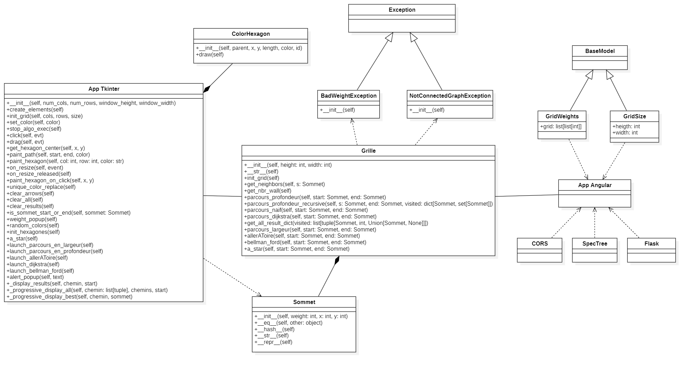
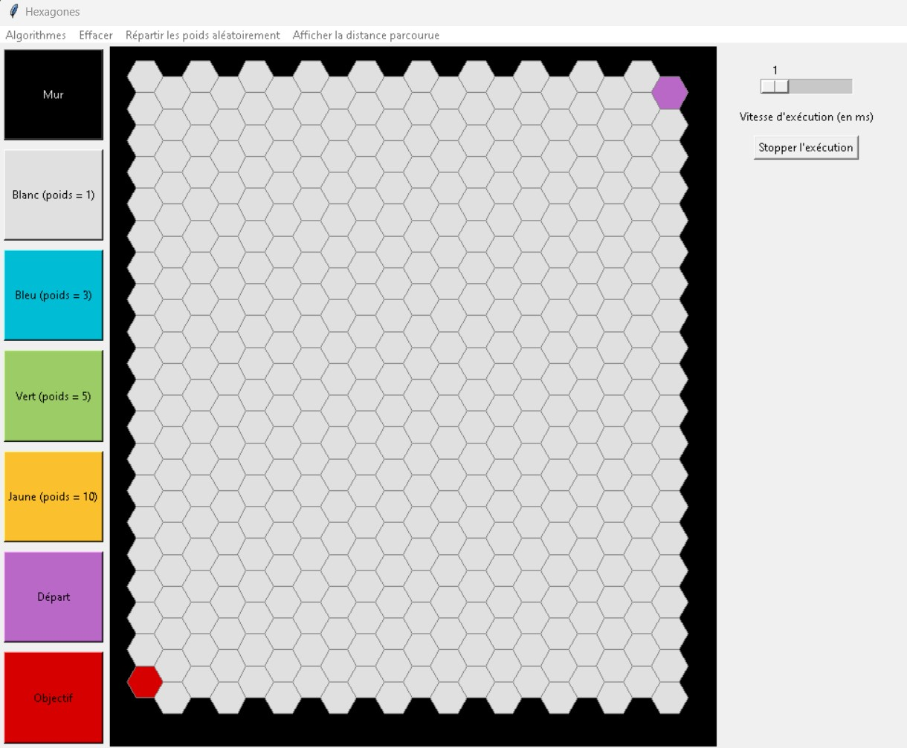
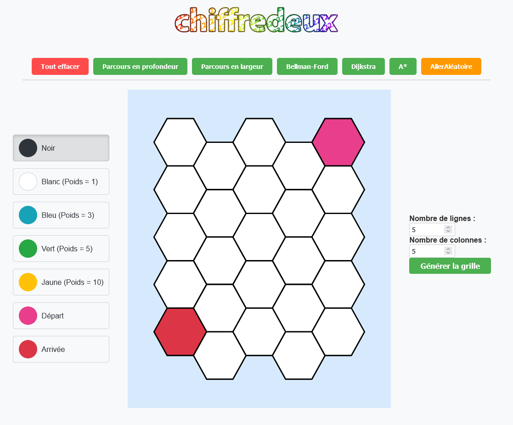
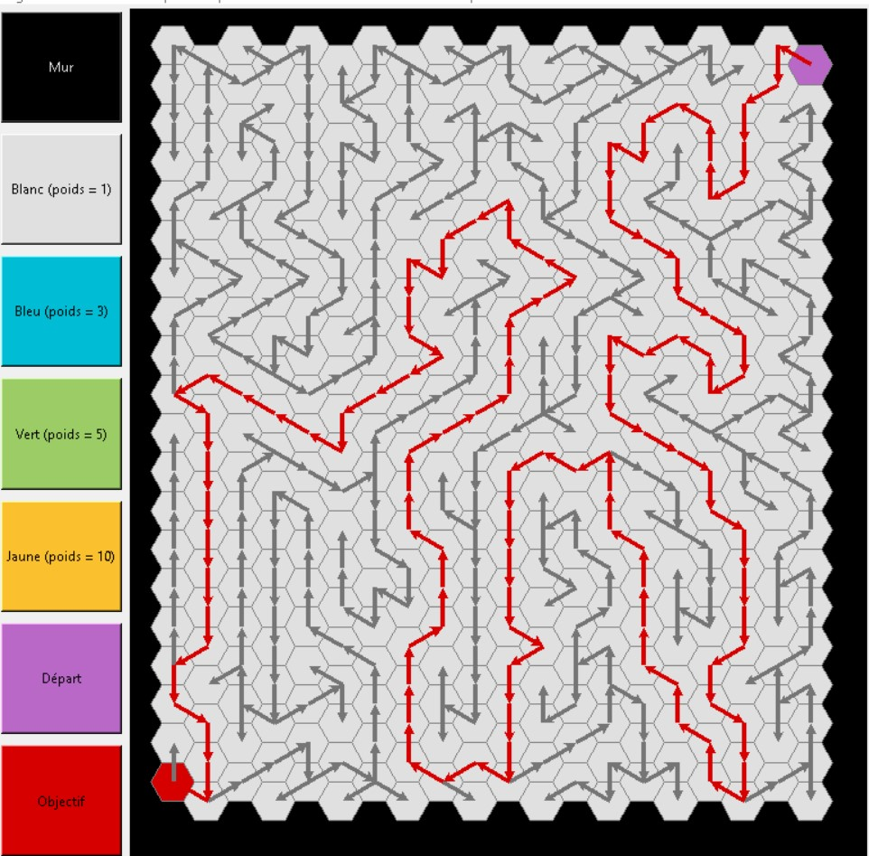
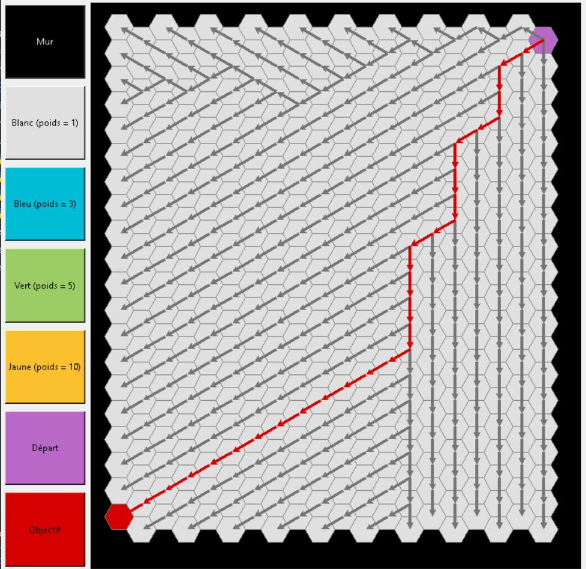
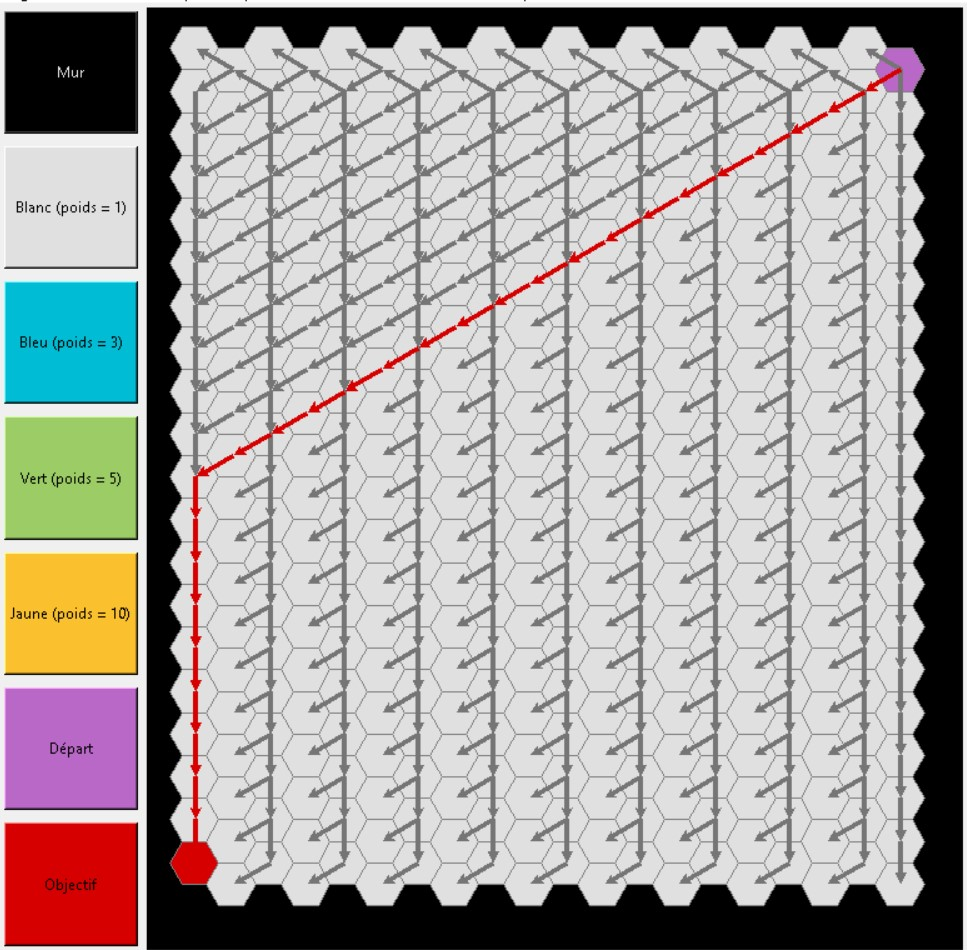
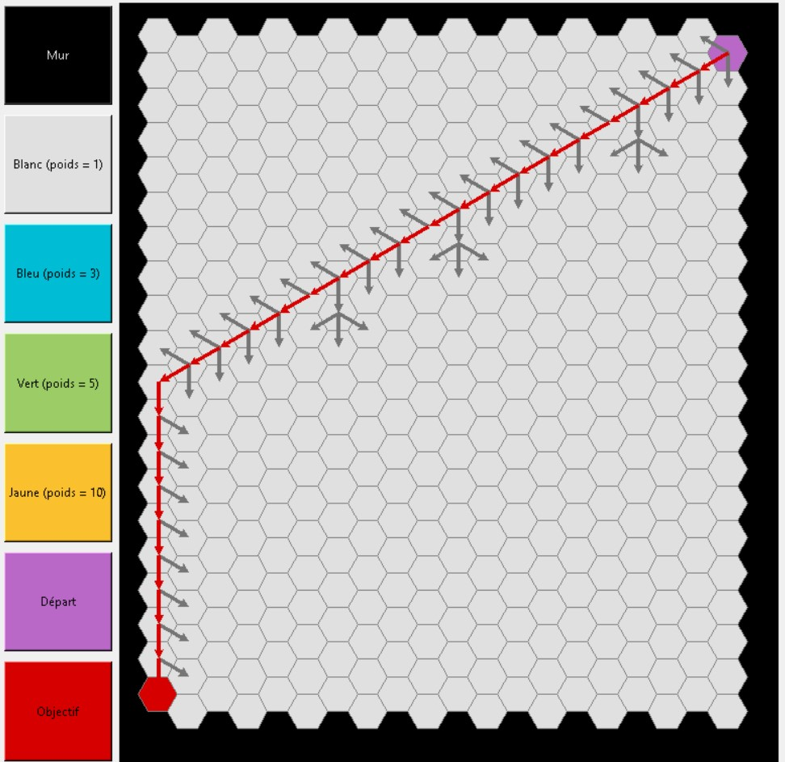
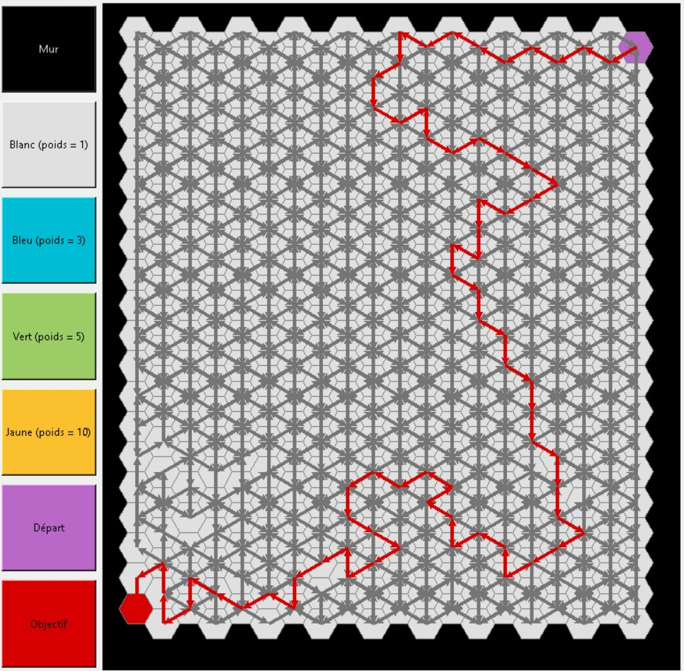

<div style="text-align: center;">
  
</div>

> **Visualisation interactive de parcours de graphes**

---

# 📋 Description

**Chiffredeux** est une application développé par des étudiants en 3ème année de BUT Informatique à l'IUT de Vélizy. Elle permet de visualiser des parcours de graphes et de comprendre le fonctionnement des 
algorithmes de recherche de chemins dans une grille hexagonale, où chaque hexagone possède un poids influençant le coût du chemin. 

**Chiffredeux** est disponible sous deux formats :
- Une **application de bureau** développée avec Python et Tkinter.
- Une **application web** créée avec Angular et connectée à une API Flask. (qui n'a pas pu être finalisée correctement par manque de temps)

Les utilisateurs peuvent choisir entre parmi plusieurs algorithmes de parcours, et l'application affichera visuellement 
le chemin parcouru et mettra en évidence le chemin d'un point A à un point B avec un tracé en rouge, selon l'algorithme de parcours 
sélectionné. **Chiffredeux** permet ainsi de mieux comprendre et de visualiser les principes des algorithmes de graphes de manière 
interactive et intuitive.

---

# Table des matières :

## 🧠 - Aspect technique
* [⚙️- Langages et outils utilisés](README.md:48)
* [💻 - Installation et configuration](README.md:73)
* [🏛️ - Architecture du logiciel](README.md:101)

## ✨ - Aspect fonctionnel
* [💻 - Présentation de l'interface avec Tkinter](README.md:124)
* [🌐 - Présentation de l'interface web avec Angular](README.md:167)

## 🔢 - Aspect théorique
* 👨🏻‍💻 - Présentation des algorithmes
  - [Parcours en profondeur](README.md:192)
  - [Parcours en largeur](README.md:214)
  - [Parcours Bellman-ford](README.md:230)
  - [Dijkstra](README.md:244)
  - [A*](README.md:258)
  - [AllerÀToire](README.md:272)

---

# 🧠 - Aspect technique
## ⚙️ - Langages et outils utilisés
* **Python :**
Le cœur de notre projet repose sur le langage Python, que nous avons utilisé pour implémenter l’ensemble des algorithmes 
de parcours ainsi que pour la gestion et le traitement des hexagones, qui sont au cœur de notre application. Python s’est 
imposé comme un choix stratégique grâce à sa simplicité et ses très bonne bibliothèques. Cela nous ont permis de développer 
des solutions performantes, tout en assurant une grande fiabilité.<br>

* **Tkinter :**
Pour l’interface graphique de l’application bureau, nous avons utilisé Tkinter, une bibliothèque native de Python. 
Tkinter nous a permis de créer une interface légère et intuitive avec des éléments interactifs tels que des boutons,
des champs de saisie ou encore la grille d'héxagone.<br>

* **Angular pour l'interface web :**
Pour répondre au besoin d’une interface web, nous avons opté pour Angular, un framework front-end basé sur TypeScript. 
Angular a été utilisé pour développer une interface utilisateur interactive et dynamique, capable de gérer efficacement 
les données en temps réel. <br>

* **API Flask :**
Pour connecter nos algorithmes Python avec l’interface web développée en Angular, nous avons utilisé une API construite 
avec le framework Flask. Flask s’est avéré être un choix idéal car nous avions déjà eu l’opportunité de l’utiliser en 
cours, ce qui nous a permis de tirer parti de notre expérience avec ce framework léger. <br>

* **Swagger :**
Pour documenter l'API et tester les différentes routes facilement. Tout comme Flask cette technologie a été utilisée en cours.

## 💻 - Installation et configuration

### Dépendences :
* [Python 3.9 ou supérieur](https://www.python.org/downloads/)
* [Node.js (v18+)](https://nodejs.org/en/download/)

### Lancement de Tkinter :
```
python .\Tkinter\src\gui.py
```

### Lancement de l'API et d'Angular (complémentaires)
#### API
```
cd web/back
pip install pdm
python -m pdm install
python -m pdm start
```

#### Angular
```
cd web/front
npm install -g @angular/cli@17
npm i 
ng serve
```

## 🏛️ - Architecture du logiciel

L’architecture logicielle de notre application repose sur une organisation modulaire qui garantit une séparation claire 
des responsabilités entre les différents composants de l'application. Le composant Modèle est représenté par le fichier 
**models.py**, qui regroupe l’ensemble des données et de la logique métier, notamment les algorithmes de parcours et la gestion 
des hexagones. Ce module constitue le cœur fonctionnel de l’application, conçu pour être indépendant de toute interface 
utilisateur.

Pour l’interface utilisateur, deux approches distinctes ont été adoptée :
- **Dans la version avec l'exécutable**, nous avons utilisé un fichier **gui.py** utilisant Tkinter pour 
concevoir une interface graphique interactive, permettant une utilisation directe des fonctionnalités de l'application.
- **Dans la version web**, une interface dynamique a été développée en Angular, rendant l’application accessible depuis un navigateur.
La connexion entre les algorithmes Python et l’interface web Angular est assurée par une API Flask utilisé comme un intermédiaire 
de communication entre les composants, facilitant les échanges de données et permettant l’intégration fluide des deux environnements.

<div style="text-align: center;">
  
  <p>Architecture logicielle utilisée</p>
</div>

---
# ✨ - Aspect fonctionnel

## 💻 - Présentation de l'interface avec Tkinter
<div style="text-align: center;">
  
  <p>Interface avec Tkinter</p>
</div>

L'interface graphique développée avec Tkinter est divisée en 4 grandes parties pour permettre une interaction claire et 
efficace avec les fonctionnalités. Voici les sections en détail :

### 1. La grille ⌗
La grille est composée de sommets hexagonales, représentant les sommets du graphe.
Elle permet de visualiser l’état du graphe, les différents poids attribués aux sommets, ainsi que les murs.

Les utilisateurs peuvent interagir avec la grille pour ajouter ou supprimer des murs, attribuer des poids, et définir un sommet de départ et un objectif.
La grille affiche également les résultats des algorithmes (différent selon l'algorithme selectionné).

### 2. Zone de sélection des poids et des murs 🎨

Cette section située sur la gauche de l’interface, contient une liste de boutons colorés correspondant aux différents types de cellules :
  - Mur (noir) : Empêche tout passage dans l’hexagone.
  - Poids : Chaque couleur correspond à un poids spécifique (exemple : bleu = 3, vert = 5, jaune = 10).
  - Départ (violet) : Marque le sommet de départ pour les algorithmes.
  - Objectif (rouge) : Définit le sommet de destination.   

L'utilisateur peut cliquer sur un bouton, puis sur un sommet de la grille pour appliquer l’action correspondante.
Cette section permet de configurer le graphe avant d’exécuter un des algorithmes.

### 3. Menu ☰

Le menu en haut de l’interface regroupe plusieurs fonctionnalité possible :
  - Algorithmes : Permet de choisir et d'exécuter un algorithme parmi ceux disponibles (Parcour en largeur, Dijkstra, etc...).
  - Effacer : Offre la possibilité d’effacer le résultat ou de réinitialiser complètement la grille.
  - Répartition aléatoire : Ajoute aléatoirement des poids et des murs sur la grille.
  - Afficher les distances : Affichage de la distance parcourue du sommet de départ au sommet d'arrivé.

### 4. Contrôle de la vitesse d'exécution 🏃🏻‍♂️

Située à droite de l’interface, cette section contient :
  - Un curseur, permettant de régler la vitesse d’exécution des algorithmes (en millisecondes).
  - Un bouton d’arrêt : Stoppe l’exécution en cours.

Ce panneau permet à l'utilisateur de ralentir ou d'accélérer l'exécution des algorithmes pour une meilleure visualisation.

## 🌐 - Présentation de l'interface web
<div style="text-align: center;">
  
  <p>Interface web avec Angular</p>
</div>

L'interface web s'inspire grandement de l'interface fait avec Tkinter, on y retrouve la même approche et les mêmes fonctionalités
décrite ci-dessus. Cependant suite à un manque de temps, nous n'avons pas pu la finaliser à 100%, par manque de temps nous n'avons pas pu corriger les défauts de l'API.

---

# 🔢 - Aspect théorique
À présent, nous allons présenter de manière théorique les différents parcours de graphe que nous avons implémentés dans 
le cadre de ce projet. Ces parcours incluent le parcours en profondeur, le parcours en largeur, l’algorithme de Bellman-Ford, 
l’algorithme de Dijkstra, l’algorithme A*, ainsi qu’un parcours spécifique que nous avons nommé AllerÀToire. Chacun de ces 
algorithmes offre une approche unique pour explorer ou trouver des chemins dans un graphe, avec des caractéristiques et 
des applications distinctes.

```
⚠️ Si le sommet de destination n'est pas atteignable car le sommet de départ et d'arrivé ne sont pas dans la même 
composante connexe, une exception est levée. Mais si le graphe n'est pas connexe et que le sommet de départ et d'arrivé sont dans la 
même composante connexe, le parcours se réalise en prenant en compte uniquement la composante connexe où se trouve le sommet 
de départ et d'arrivé.
```

## Parcours en profondeur
Le parcours en profondeur est une méthode classique utilisée pour explorer un graphe. 
Elle fonctionne en partant d’un sommet de départ et en explorant autant que possible chaque chemin avant de revenir en 
arrière lorsque l'on atteint une impasse (sommet avec que des voisins visités ou un mur). Une fois une impasse atteinte, 
il revient en arrière pour explorer d'autres voisins non visités du sommet précédent et cela se fait récursivement dans notre cas.
Les sommets visités sont enregistrés dans un dictionnaire de set pour éviter les doublons car un sommet ne peut être visité qu'une seul fois 
mais un même sommet peut visité plusieurs autres sommets.

Une fois le parcours terminée, on démarre du sommet d'arrivée puis on remonte de chaque sommet à son parent (le sommet qui l'a visité) 
jusqu'à atteindre le sommet de départ et en inversant la séquence nous obtiendrons enfin le chemin menant du sommet de départ au sommet
d'arrivé.

Le parcours en profondeur ne garantit pas le chemin le plus court dans un graphe et il peut explorer inutilement de 
nombreuses branches d’un graphe avant de trouver la solution.


### Exemple de parcours en profondeur :
<div style="text-align: center;">
  
  <p>Figure 1 : parcours en profondeur</p>
</div>

## Parcours en largeur
Le parcours en largeur est une méthode pour explorer un graphe de manière organisée en visitant les sommets niveau par 
niveau. On commence par le sommet de départ, qu'on explore en visitant tous ses voisins directs. Une fois que tous ces 
voisins sont visités, on passe à leurs voisins, puis aux voisins des voisins, et ainsi de suite, jusqu'à ce que tout le 
graphe soit exploré.

Pour y arriver, on utilise une file (**queue** dans notre programme) , une sorte de liste qui garde les sommets à visiter 
dans l'ordre où on les découvre. On prend toujours le premier sommet de la file pour le visiter, puis on ajoute ses voisins 
à la fin de la file, et ainsi de suite.

### Exemple de parcours en largeur :
<div style="text-align: center;">
  
  <p>Figure 2 : parcours en largeur</p>
</div>

## Parcours avec l’algorithme de Bellman-Ford
L'algorithme de Bellman-Ford est utilisé pour calculer les chemins les plus courts dans un graphe pondéré en prenant en 
compte les sommets à poids négatifs, mais dans notre algorithme c'est différent, nous avons fait en sorte qu'il ne prend 
pas en compte les sommets à poids négatifs car notre application n'en possède pas. Elle initialise les distances à l'infini 
sauf pour le point de départ (distance 0) et met à jour ces distances en répétant un processus de relaxation c'est à dire 
vérifier pour chaque sommet si passer par un autre sommet offre un chemin plus court. À chaque mise à jour, on ajuste également 
les prédécesseurs pour reconstruire le chemin optimale. 

### Exemple de parcours avec l’algorithme de Bellman-Ford:
<div style="text-align: center;">
  
  <p>Figure 3 : parcours bellman-Ford</p>
</div>

## Parcours avec l’algorithme de Dijkstra
L'algorithme de Dijkstra est un algorithme utilisé pour trouver les chemins les plus courts entre un sommet de départ et 
tous les autres sommets d'un graphe pondéré. Il utilise une file de priorité (queue) pour explorer les sommets en fonction 
de leur coût cumulé depuis le départ. Les sommets visités sont enregistrés dans une liste (visited) avec leur coût total 
et leur prédécesseur. Lorsqu'un voisin accessible est trouvé, l'algorithme vérifie s'il est déjà dans la file et met à jour 
son coût si un chemin plus court est découvert. Une fois le sommet d'arrivé atteint l'algorithme reconstitue le chemin 
optimal en retraçant les prédécesseurs de l'arrivé au départ.

### Exemple de parcours Dijkstra :
<div style="text-align: center;">
  
  <p>Figure 4 : parcours dijkstra</p>
</div>

## Parcours avec A*
L’algorithme A* combine une fonction heuristique de Manhattan et un coût de déplacement pour trouver le chemin le plus 
efficace entre le sommet de départ et le sommet d'arrivé. Il commence par calculer les distances heuristiques de chaque 
sommet à l’aide de la méthode heuristique_manhattan que nous avons implémenté, qui mesure la distance absolue en x et en 
y jusqu’au sommet d'arrivé. L’algorithme maintient une file de priorité (queue), triée par le coût total d'accès (coût de 
déplacement accumulé + heuristique de manhattan), et explore les voisins accessibles tout en mettant à jour les coûts et 
les prédécesseurs. Une fois le sommet final atteint, l’algorithme reconstruit le chemin optimal en retraçant les prédécesseurs.

### Exemple du parcours A* :
<div style="text-align: center;">
  
  <p>Figure 5 : parcours A*</p>
</div>

## Parcours AllerÀToire
Cet algorithme, nommé **allerAToire** effectue un parcours aléatoire en partant d'un sommet de départ pour atteindre le 
sommet de fin. Il utilise une file (queue) pour gérer les sommets à explorer et suit deux objectifs principaux : (1) 
construire un dictionnaire des sommets atteignables et leurs voisins, et (2) enregistrer le chemin parcouru sous forme de 
relations entre sommets. Une fois le sommet final atteint ou la file vidée, l'algorithme retourne les sommets atteignables 
et le chemin parcouru.S'agissant d'un parcours aléatoire, il ne retournera presque jamais le même parcours 2 fois de suite.

### Exemple du parcours AllerÀToire :
<div style="text-align: center;">
  
  <p>Figure 6 : parcours AllerÀToire</p>
</div>